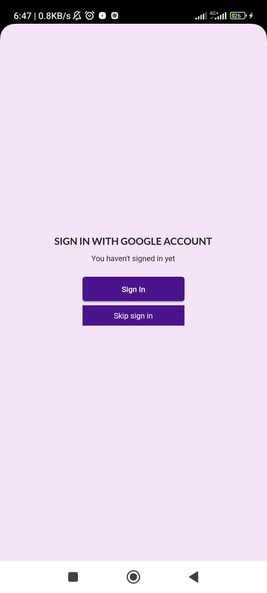
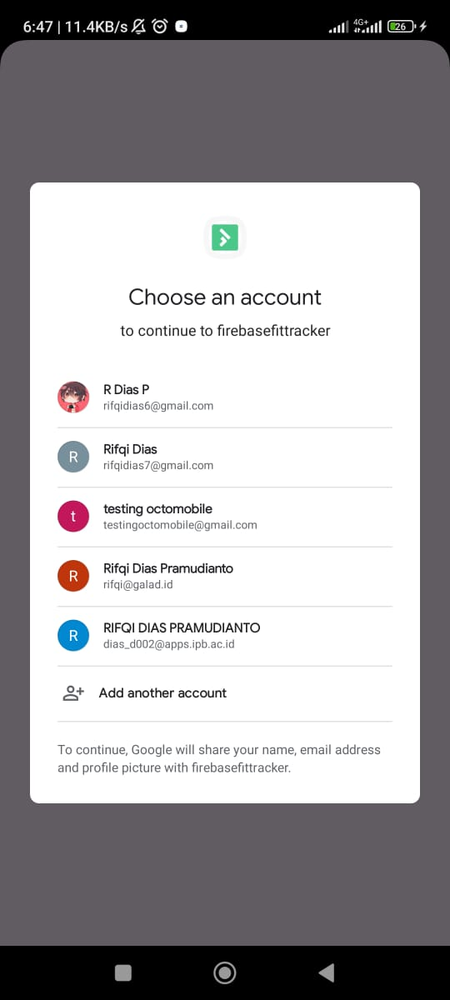
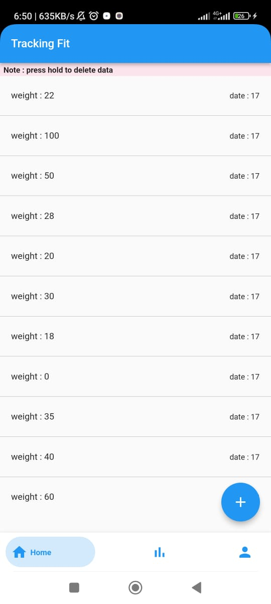
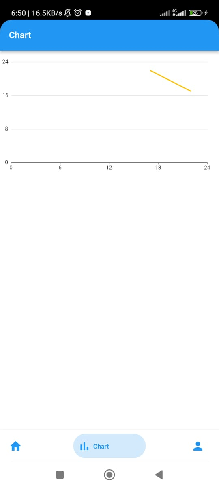
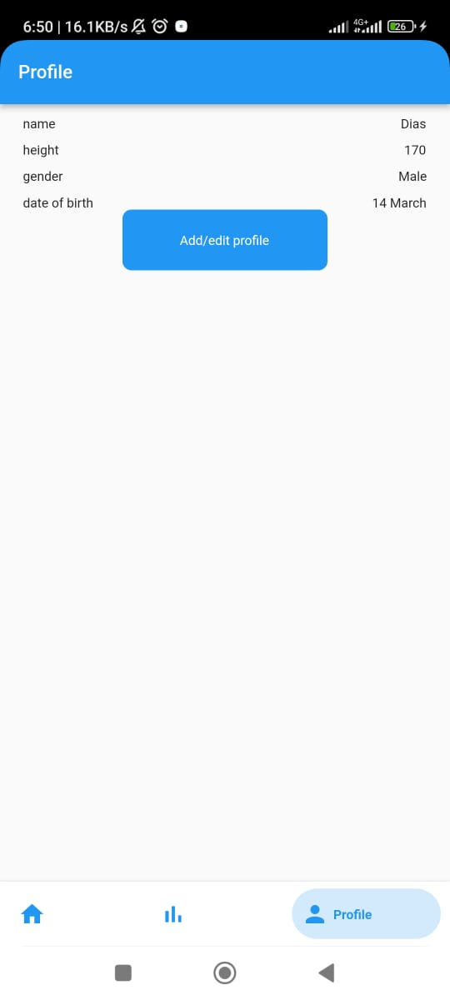

<div align="center" id="top"> 
 
    
      
        
        


  &#xa0;

  <!-- <a href="https://firebasefittracker.netlify.app">Demo</a> -->
</div>


<h1 align="center">Firebasefittracker</h1>


<p align="center">
  <a href="#dart-about">About</a> &#xa0; | &#xa0; 
  <a href="#sparkles-features">Features</a> &#xa0; | &#xa0;
  <a href="#rocket-technologies">Technologies</a> &#xa0; | &#xa0;
  <a href="#white_check_mark-requirements">Requirements</a> &#xa0; | &#xa0;
  <a href="#checkered_flag-starting">Starting</a> &#xa0; | &#xa0;
  <a href="#memo-license">License</a> &#xa0; | &#xa0;
  <a href="https://github.com/{{YOUR_GITHUB_USERNAME}}" target="_blank">Author</a>
</p>

<br>

## :dart: About ##

Describe your project
Fit tracker for tracing your weight


## :rocket: Technologies ##

The following tools were used in this project:

- [FVM](https://fvm.app/)
- [Dart](https://dart.dev/)
- [Flutter](https://flutter.dev/)
- [Provider](https://pub.dev/packages/provider)
- [Firebase](https://firebase.google.com/)
- [FireStore](https://firebase.google.com/docs/firestore)

## :white_check_mark: Requirements ##

Before starting :checkered_flag:, you need to have [Flutter](https://flutter.dev/) and [Dart](https://dart.dev/) installed.

## :checkered_flag: Starting ##

```bash
# Clone this project
$ git clone https://github.com/RifqiDias/firebasefittracker

# Access
$ cd firebasefittracker

# Install dependencies
$ flutter pub get

# Run the project
$ flutter run start


This project is a starting point for a Flutter application.

A few resources to get you started if this is your first Flutter project:

- [Lab: Write your first Flutter app](https://docs.flutter.dev/get-started/codelab)
- [Cookbook: Useful Flutter samples](https://docs.flutter.dev/cookbook)

For help getting started with Flutter development, view the
[online documentation](https://docs.flutter.dev/), which offers tutorials,
samples, guidance on mobile development, and a full API reference.


Made with :heart: by <a href="https://github.com/RifqiDias" 

<a href="#top">Back to top</a>

